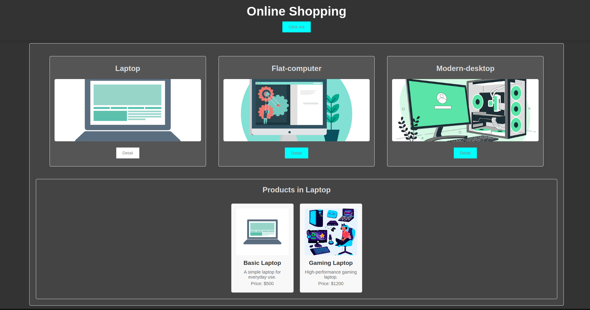

# GruppenProjekt-Andre-Orhan-Norman

Dies ist eine Gruppenaufgabe von **André**, **Orhan** und **Norman**.

## Projektbeschreibung

Dieses Projekt ist ein Online-Shopping-System, das in Zusammenarbeit zwischen André, Orhan und Norman entwickelt wurde. Ziel ist es, eine Plattform zu erstellen, auf der Benutzer verschiedene Produkte durchsuchen und Details zu jedem Produkt anzeigen können.

## Vorschau

Hier ist ein Screenshot des Projekts:



## Funktionen

- Übersicht über verschiedene Produktkategorien.
- Anzeige von Details für jedes Produkt.
- Responsive Design für die optimale Darstellung auf verschiedenen Geräten.

## Installation

Um das Projekt lokal auszuführen, befolgen Sie bitte die folgenden Schritte:

1. **Repository klonen:**
   ```bash
   git clone https://github.com/DoctorHinky/GruppenProjekt-Andre-Orhan-Norman.git
   ```

2. **In das Projektverzeichnis wechseln:**
   ```bash
   cd GruppenProjekt-Andre-Orhan-Norman
   ```

## Verwendung

1. Starten Sie das Projekt:
   - Wenn es sich um ein statisches Projekt handelt, öffnen Sie `index.html` in Ihrem Browser.
   
2. Navigieren Sie zu den verschiedenen Kategorien und sehen Sie sich die Produktdetails an.

## Beitragende

- **André**
- **Orhan**
- **Norman**

## Lizenz

Dieses Projekt ist unter der MIT-Lizenz lizenziert. Weitere Informationen finden Sie in der Datei [LICENSE](LICENSE).

## Kontakt

Bei Fragen oder Anregungen wenden Sie sich bitte an die Projektmitarbeiter.

---

Vielen Dank, dass Sie sich die Zeit genommen haben, unser Projekt anzusehen!
```